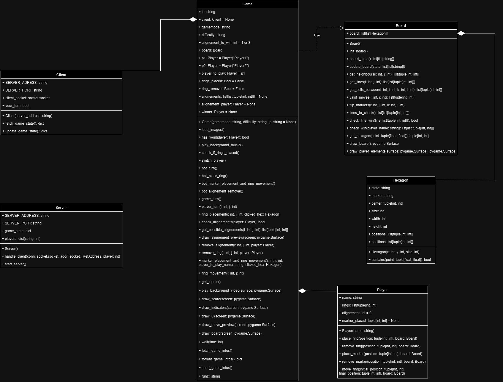
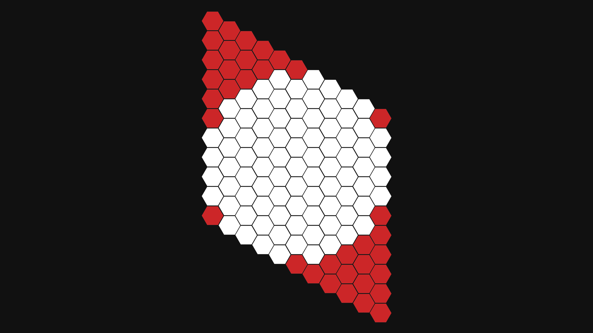

# YINSH


This project is a Python adaptation of the board game Yinsh. Yinsh is an abstract strategy board game for two players designed by Kris Burm and published by Rio Grande Games. The game features simple rules yet complex strategic depth, making it a challenging and engaging experience for players.

# Table of Contents
1. [YINSH](#yinsh)
2. [Technologies Used](#technologies-used)
3. [Getting Started](#getting-started)
	- [Prerequisites](#prerequisites)
	- [Launching the Project](#launching-the-project)
4. [Maintaining the Project](#maintaining-the-project)
	- [File organisations](#file-organisations)
	- [Python Coding Style](#python-coding-style)
	- [Contributing GIT Guidelines](#contributing-git-guidelines)
5. [Code Structure](#code-structure)
	- [Class Diagram](#class-diagram)
	- [Algorithms Used](#algorithms-used)
		- [Hexagonal Grid Management](#hexagonal-grid-management)
		- [Ring Movement](#ring-movement)
		- [Alignement Detection](#alignement-detection)
		- [Alignement Selection](#alignement-selection)
	- [Network](#network)
		- [Server](#server)
		- [Client](#client)
		- [Data Exchange Format](#data-exchange-format)
6. [License](#license)

# Technologies Used

In this project, we have chosen Python as the primary language for the implementation. We had envisaged to choose the C programming language for this project but it has mainly not been used because of the compatibility complexity with multiple platforms as well as the code complexity which was increased compared to Python. The decision to use Python was based on several factors, including:

- **Community Support**: Python has a large and active community, which means there are plenty of resources, libraries, and frameworks available to support our development process.

- **Compatibility**: Python is compatible with the platforms and systems we are targeting, ensuring that our code can run smoothly across different environments.

- **Familiarity**: The development team has extensive experience and expertise in Python, which will facilitate the development process and reduce the learning curve.

Additionally, we have chosen to utilize Pygame as a key library for this project. Pygame provides a wide range of functionalities and features that align with our project requirements, including game development. Its robustness, reliability, and active community support make it an ideal choice for our development needs.

> By selecting **Python** and **Pygame**, we aim to achieve a balance between performance, maintainability, and ease of development, ensuring a successful implementation of our project.

# Getting Started

These instructions will get you a copy of the project up and running on your local machine for development and testing purposes.

## Prerequisites

- Python 3.11+

## Launching the Project

1. Clone the repository to your local machine.
```sh
git clone https://github.com/r-witz/yinsh.git
```

2. Navigate to the project directory.
```sh
cd yinsh
```

3. Once Python installed run the following command to install both dependencies
```sh
pip install -r requirements.txt
```

4. Run the main.py file to launch the project.
```sh
python main.py
```

# Maintaining the Project

These instructions will give you the basic knowledge about the project organisation, so you can maintain or understand it.

## File organisations

```bash
yinsh/
│
├── assets/                      # Folder for storing game's assets.
│   ├── audio/                   # Game audio.
│   ├── fonts/                   # Game fonts.
│   └── graphics/                # Other assets (i.e. images, video).
├── docs/                        # Folder for documentation files.
├── ├── technical_manual.pdf     # Technical documentation in pdf version.
├── ├── user_manual.pdf      	 # User manual in pdf version.
│   ├── technical_manual.md      # Technical documentation.
│   └── user_manual.md           # User manual.
├── src/                         # Source code directory.
│   ├── menu.py			 # The file used for the intro and managing menus.
│   ├── resizing.py		 # Contain some resizing utilities.
│   ├── settings.py		 # Manages the settings window.
│   ├── utilities.py		 # Utilities for menus.
│   ├── board.py                 # Game board logic and operations.
│   ├── game.py                  # Controls game flow, rules, and victory.
│   ├── hexagon.py               # Properties and behaviors of hexagons in board.
│   ├── player.py                # Player properties, and methods.
│   ├── server.py                # Sets up and manages the game server.
│   ├── scan.py			 # Scan the network to find running servers.
│   └── client.py                # Sets up and manages the game client.
├── main.py                      # Program used to launch game.
├── requirements.txt             # Libraries required.
├── .gitignore                   # Files to ignore when commiting.
├── LICENSE                      # Project's License.
└── README.md                    # Describe the project and how to install.
```

> To maintain the project, you should have a basic understanding of Python and Pygame. You should also be familiar with the project structure and the codebase.

## Python Coding Style

**Variable Naming:**

1. **snake_case**: For variable and function names (eg. `player_turn`, `game_state`).
2. **UPPERCASE**: For constants (eg. `BOARD_SIZE`, `MAX_PLAYERS`).
3. **PascalCase**: For classes (eg. `GameLogic`, `BoardRenderer`).

**Docstring Conventions:**

1. **Use triple quotes:** For docstrings, use triple double quotes (`"""`).
2. **Write descriptive docstring:** Describe the purpose and functionality of functions, classes and modules concisely but comprehensively.
3. **Include type information:** Add parameters types, return types (Look at already written code for exemples).

**Type Hinting:**

1. **Use type hints:** Provide type hints for functions parameters, return values, and variables when possible.
2. **Use built-in types:** Perfer built-in types (`int`, `str`, `list`, `dict`, etc.).
3. **Type hints for collections:** For collections, use `list[type]`, `dict[key_type, value_type]`, etc...

**Exemple Docstring with Type Hinting:**

```python
def calculate_score(player_turn: int, game_state: dict[str, list[int]], multiplier: int = 1) -> int:
	"""
	Calculate the score for the current player.
	:param player_turn: int, The index of the current player.
	:param game_state: Dict[str, List[int]], The state of the game. Keys are player identifiers, Values are lists of scores for each player.
	:param multiplier: int(optional), A multiplier to adjust the score calculation. Defaults to 1.
	:return: int, The calculated score for the player.
	"""
	# Function implementation goes here
```

## Contributing GIT Guidelines

Contributors are encouraged to adhere to the following guidelines when contributing to the project.

Use Git for version control, and adhere to the commit message structure and branch naming conventions outlined in the [git conventional commits](https://www.conventionalcommits.org/en/v1.0.0/
). Here are some highlights about it :

**Commit Types:**

1. **feat:** Use for new features implemented.
2. **fix:** Use for bug fixes.
3. **refactor:** Use for code refactoring.
4. **docs:** Use for documentation updates.
5. **test:** Use for adding or modifying tests.
6. **chore:** Use for general maintenance or miscellaneous tasks.

Add "!" at the end of the keyword to denote a breaking change (e.g., `feat!`, `fix!`, etc.).

**Example Commit Messages:**

- feat!(graphics): Add new background image
- fix(network): Fix connection timeout issue
- docs(user): Update user manual for gameplay instructions
- test(utils): Add unit tests for utility function
- refactor(game): Refactor game logic for improved performance
- chore!(deps): Update dependencies to latest versions

# Code Structure

If you wish to know more about data structures used throughout the whole project, you may refer directly to the code. <br>
All the classes, functions and methods are documented using type hinting and docstring, making it as simple as possible to understand the datatypes used.

## Class Diagram



> This class diagram is representing how the main game logic is made. <br>
It will also help you understand how the classes interact with each others.

## Algorithms Used

### Hexagonal Grid Management:

The hexagonal grid management in the game involves initializing a hexagonal grid structure, placing hexagonal tiles, and managing their properties and interactions. This section explains the process of creating and managing the hexagonal grid on the game board, leveraging the [`Hexagon`](../src/hexagon.py) class to define individual hexagonal tiles and their behaviors. The key aspects of this algorithm include:

- **Hexagons Representation**: Hexagons are represented by a Class, having an x, y position and size to draw them. It then can work out its width, height, and 6 vertexes. It then has a method that check if a given point is in the Hexagon.
<br>For more information go see the [`hexagon.py`](../src/hexagon.py) file and the `init_board` method in the [`board.py`](../src/board.py) file
- **Grid Initialization**: Initializes the grid by creating Hexagonal tiles and positioning them correctly based on their coordinates. Each tile is assigned a unique identifier and positioned using axial or offset coordinates to maintain the hexagonal structure.
- **Tile Adjacency**: Calculates adjacent tiles for any given tile, facilitating movement and interaction within the grid. This is done using predefined direction vectors that represent the six possible neighboring positions in a hexagonal layout.
<br>For more information go see the `get_neighbours` method in the [`board.py`](../src/board.py) file
- **Drawing the Board**: The board is drawn using the tile adjency. We iterate through each tile of the board, get its center, and then for each neighbour got through tile adjency, we draw a line towards that neighbour.
<br>For more information go see the `draw_board` method in the [`board.py`](../src/board.py) file


> You can here see how the grid is represented in backend. The red hexagons represent None types in the board, this means the tile is not an Hexagon, it is just here to space the rest of the board tiles. The white hexagons are the one actually clickable and are Hexagon types.

### Ring Movement:

The ring movement algorithm in the game involves several key steps: selecting a ring to move, determining valid destinations for the ring, moving the ring to the selected destination, and flipping markers along the path of movement. Here, we break down these steps to explain how the process is handled.

**Steps Involved in Moving a Player's Ring**

1. **Selecting the Ring to Move:**<br>
        The player selects a ring to move by clicking on it. This interaction is captured through a mouse event in the game interface. The position of the click is then mapped to the corresponding hexagon on the board.
        The method [`get_hexagon`](../src/board.py) in the Board class is used to determine the hexagon corresponding to the click position. It returns the coordinates of the hexagon if the click is within its bounds.

2. **Determining Valid Moves:**<br>
        Once a ring is selected, the game calculates all the valid cells where the ring can be moved. This is achieved using the [`valid_moves`](../src/board.py) method in the Board class.
        The [`valid_moves`](../src/board.py) method relies on the [`get_lines`](../src/board.py) method to identify all potential paths (vertical, horizontal, and diagonal) from the ring's current position. It ensures that rings cannot jump over other rings and must move through empty cells.
        The [`get_lines`](../src/board.py) method generates all possible lines originating from the current position of the ring, considering the hexagonal grid's geometry.
        For each line, the algorithm checks the cells sequentially. If it encounters an empty cell, it is considered a valid move. If it encounters a ring, it stops further checking along that line.

3. **Moving the Ring:**<br>
        The player then selects one of the valid moves. The ring is moved from its initial position to the final position using the move_ring method in the Player class.
        The [`move_ring`](../src/player.py) method first removes the ring from its initial position using the [`remove_ring`](../src/player.py) method and then places it at the new position using the [`place_ring`](../src/player.py) method.
        Both [`remove_ring`](../src/player.py) and [`place_ring`](../src/player.py) methods update the state of the respective hexagons on the board to reflect the ring's movement.

4. **Flipping Markers:**<br>
		After moving the ring, any markers between the initial and final positions are flipped. This is handled by the [`flip_markers`](../src/board.py) method in the Board class.
        The [`flip_markers`](../src/board.py) method first retrieves all the cells between the initial and final positions using the [`get_cells_between`](../src/board.py) method.
        It then iterates through these cells (excluding the starting and ending cells), and flips the markers. The marker is flipped from "MARKER_P1" to "MARKER_P2" and vice versa. If a cell contains no marker, it remains unchanged.

### Alignement Detection:

In the game of Yinsh, an alignment occurs when a player successfully lines up five of their markers (rings or markers) either horizontally, vertically, or diagonally. The alignment detection algorithm is responsible for identifying these alignments on the game board. Here's how the algorithm works:

1. **Defining Alignments to Check:**<br>
   The algorithm begins by defining the various lines on the board that could potentially contain alignments. These lines include horizontal, vertical, and diagonal lines. The [`lines_to_check`](../src/board.py) method in the Board class generates all possible lines on the board where alignments could occur.

2. **Iterating Through Lines:**<br>
   Once the lines to check are defined, the algorithm iterates through each line to determine if an alignment exists. For each line, it checks if there are five consecutive markers of the same player. If such a sequence is found, it signifies an alignment.

3. **Checking Line Win:**<br>
   The [`check_line_win`](../src/board.py) method in the Board class is responsible for checking if a particular line contains an alignment of five markers belonging to the same player. It iterates through the cells in the line, counting the number of markers belonging to the player. If the count reaches five, it indicates a win.

4. **Identifying Aligned Lines:**<br>
   As the algorithm iterates through each line, it keeps track of any lines where an alignment is detected. If an alignment is found, the line is added to a list of aligned lines.

5. **Returning Aligned Lines:**<br>
   Once all lines have been checked, the algorithm returns the list of aligned lines. These aligned lines represent the locations on the board where a player has successfully created an alignment of five markers.

6. **Determining the Winner:**<br>
   The aligned lines can be used to determine if a player has won the game. If a player has at least one alignment, they are declared the winner in Blitz mode, and in Normal mode, the player needs at least three alignements. Otherwise, the game continues until a winner is determined or the board is filled, resulting in a loss for the first player that can't move the selected ring.

By systematically checking each line on the board, the alignment detection algorithm accurately identifies alignments, allowing the game to progress and determine the winner based on these alignments.

### Alignement Selection:

In the game of Yinsh, if multiple alignments are made by a player, the player is allowed to choose which alignment they want to remove. The alignment selection algorithm facilitates this process by enabling the player to hover over potential alignments and preview them before making a decision. Here's how the algorithm works:

1. **Identifying Potential Alignments:**<br>
	The [`get_possible_alignement`](../src/game.py) method first determines if the hexagon being hovered over is part of any alignments. It does this by checking if the coordinates of the hexagon match any of the coordinates within the aligned lines detected by the alignment detection algorithm.

2. **Handling Multiple Alignments:**<br>
   If the hexagon is part of multiple alignments, the method evaluates each alignment to determine which one to prioritize for preview. It considers factors such as the proximity of the hexagon to the center of each alignment and the direction of the alignment.

3. **Returning the Selected Alignment:**<br>
   Once the alignment is selected, the method returns the coordinates of the cells involved in that alignment. These coordinates are then used to draw the alignment preview on the game board, allowing the player to visualize the potential consequences of their actions.

4. **Player Interaction:**<br>
   Throughout this process, the method ensures that the player's interaction with the game remains intuitive and responsive. It provides real-time feedback based on the player's mouse movements, updating the alignment preview as the player hovers over different hexagons on the board.

By effectively prioritizing alignments and providing clear visual previews, the [`get_possible_alignement`](../src/game.py) method enhances the player's understanding of the game state and facilitates strategic decision-making during gameplay.

## Network

The network aspect of the project facilitates communication between the game server and clients, allowing two players to connect to the same game session and interact with each other in real-time.

### Server

The server, implemented in [`server.py`](../src/server.py), manages the game state and facilitates communication with the connected clients. Here's how it works:

1. **Initialization**: Upon starting, the server initializes its state, including the game board, player information, and other game-related data.

2. **Socket Binding**: The server creates a socket and binds it to a local address and port. This allows it to listen for incoming connections from clients.

3. **Accepting Connections**: The server enters a loop where it continuously listens for incoming client connections. Once a client connects, the server accepts the connection and assigns it to a player slot (Player1 or Player2).

4. **Handling Clients**: For each client connection, the server spawns a new thread ([`handle_client`](../src/server.py)) to handle communication with that client. This ensures that the server can handle multiple clients concurrently.

5. **Client Communication**: The [`handle_client`](../src/server.py) function manages communication with each client. It receives requests from clients, processes them, updates the game state if necessary, and sends back responses.

6. **Game State Management**: The server maintains the game state, including the current board configuration, player turns, ring positions, alignments, and other relevant data. It updates this state based on the requests received from clients.

7. **Data Serialization**: To facilitate communication between the server and clients, data is serialized using JSON format. Requests and responses exchanged between the server and clients are encoded as JSON objects.

### Client

The client, implemented in [`client.py`](../src/client.py), represents a player connecting to the game server. Here's how it works:

1. **Initialization**: Upon initialization, the client establishes a connection to the server using a socket. It specifies the server's address and port to connect to.

2. **Fetching Game State**: The client can request the current game state from the server by sending a fetch request. This request includes the type of operation (fetch), and the server responds with the current game state, including the board configuration, player turns, and other relevant data.

3. **Updating Game State**: The client can update the game state by sending a request to the server. This request includes the updated game state, and the server processes it, updating its internal state accordingly.

4. **Handling Errors**: The client handles exceptions that may occur during communication with the server, such as network errors or invalid responses. It provides error handling mechanisms to ensure robustness and reliability.

5. **Data Serialization**: Similar to the server, the client serializes data using JSON format for communication with the server. Requests and responses are encoded as JSON objects before being sent over the network.

### Data Exchange Format

The communication between the server and clients involves exchanging JSON-formatted data. Here's a brief overview of the key data exchanged:

- **Request Format**: Requests sent from clients to the server typically include the type of operation (fetch or update) and any additional data required for the operation.

- **Response Format**: Responses sent from the server to clients include the result of the operation (success or error) and any relevant data associated with the operation, such as the current game state.

- **Game State Format**: The game state includes information about the current board configuration, player turns, ring positions, alignments, and other relevant data. This data is represented as a JSON object and exchanged between the server and clients during fetch and update operations.

By using a standardized data exchange format and implementing robust communication mechanisms, the server and clients can effectively interact with each other, enabling seamless multiplayer gameplay.

# License

This project is licensed under the GNU General Public License. For more details, see the [`LICENSE`](../LICENSE) file.
