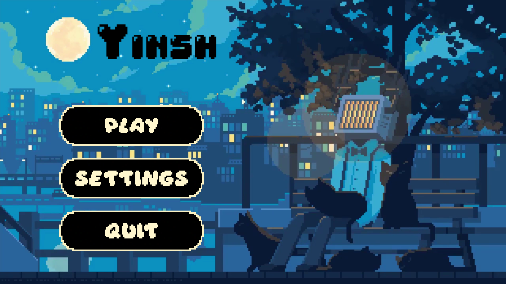

# YINSH



This project is a Python adaptation of the board game Yinsh. Yinsh is an abstract strategy board game for two players designed by Kris Burm and published by Rio Grande Games. The game features simple rules yet complex strategic depth, making it a challenging and engaging experience for players.

# Table of Contents
1. [YINSH](#yinsh)
2. [Getting Started](#getting-started)
	- [Prerequisites](#prerequisites)
	- [Launching the Project](#launching-the-project)
3. [How to use the game](#)
4. [Rules](#)
5. [License](#license)

# Getting Started

These instructions will get you a copy of the project up and running on your local machine for development and testing purposes.

## Prerequisites

- Python 3.11+

Once Python installed run the following command to install both dependencies
```sh
pip install -r .\requirements.txt
```

## Launching the Project

1. Clone the repository to your local machine.
```sh
git clone https://github.com/r-witz/yinsh.git
```

2. Navigate to the project directory.
```sh
cd yinsh
```

3. Run the main.py file to launch the project.
```sh
python main.py
```

# How to Play the Game

The game is mainly clickable, meaning you interact with the game primarily through clicking.

## Commands

### Menu

- **Opening the Settings Menu**: Press the `Echap` key (Esc) to open the settings menu.

### Leave The Game

- **Quitting the Game**: To quit the game, you can press `ALT+F4` or use the "Leave" button available in the game's interface.


# YINSH Game Rules

## Objective

The objective of YINSH is to be the first player to remove three of their own rings from the board. This is achieved by creating a row of five markers of the player's color.

## Components

- 1 game board
- 5 rings per player (in two colors)
- Markers in two colors (black on one side, white on the other)

## Setup

1. Each player chooses a color and takes 5 rings of that color.
2. Players place their rings on the intersections of the lines on the game board. Rings can be placed on any intersection except the central one, taking turns to place one ring at a time.

## Gameplay

- **Turn Sequence**:
  1. **Place a Marker**: Place a marker inside one of your rings. Markers are placed with the side showing your opponent's color face-up.
  2. **Move a Ring**: Move one of your rings along the lines on the board. Rings can move any number of spaces but must move in a straight line and cannot pass over another ring. Rings can pass over markers.

- **Flipping Markers**: When a ring passes over a marker, that marker is flipped to show the opposite color. Multiple markers can be flipped in a single move if they are all in a continuous line.

- **Forming a Row**: If a player creates a continuous row of five markers of their color (horizontally, vertically, or diagonally), they must remove those markers from the board and then remove one of their rings. The first player to remove three rings wins the game.

## Additional Rules

- **Jumping**: A ring must always end its move on an empty intersection. It cannot jump over another ring.
- **Continuous Line**: When flipping markers, they must form a continuous line, and all markers in that line are flipped.

## Winning the Game

### Normal Mode

- The game ends immediately when a player removes their third ring. That player is declared the winner.

### Blitz Mode

- In Blitz mode, the game ends immediately when a player removes their first ring. That player is declared the winner.

## Example Moves

1. Player A places a marker in one of their rings.
2. Player A moves that ring along the lines to an empty intersection.
3. As the ring moves, it passes over one or more markers, flipping them to show the opposite color.

## Strategy Tips

- **Control the Center**: Controlling the center of the board gives more flexibility for creating rows and flipping markers.
- **Anticipate Moves**: Try to predict your opponent's moves and prevent them from forming rows of their color.
- **Create Multiple Threats**: Force your opponent to respond to multiple threats, increasing the chances of creating a row.

Enjoy playing YINSH!


# License

This project is licensed under the GNU General Public License. For more details, see the [`LICENSE`](../LICENSE) file.